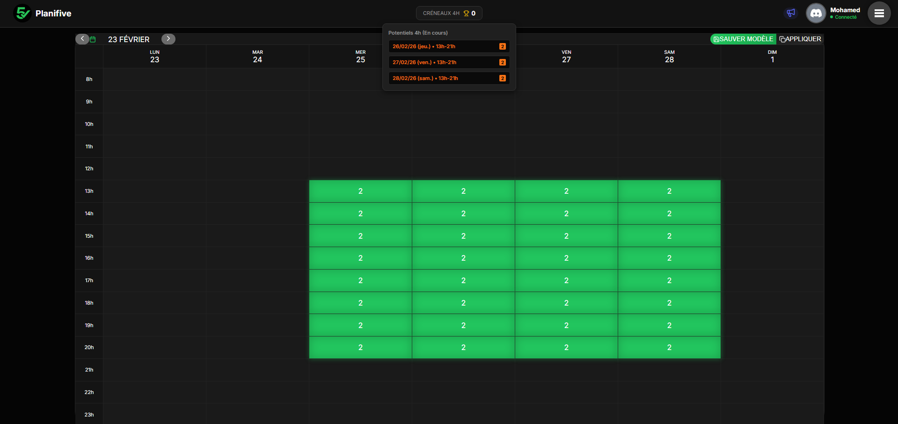
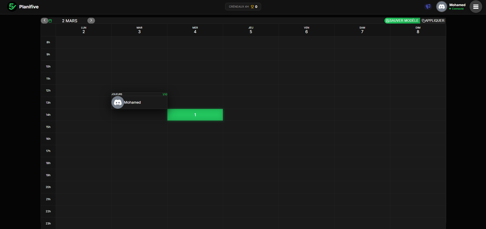
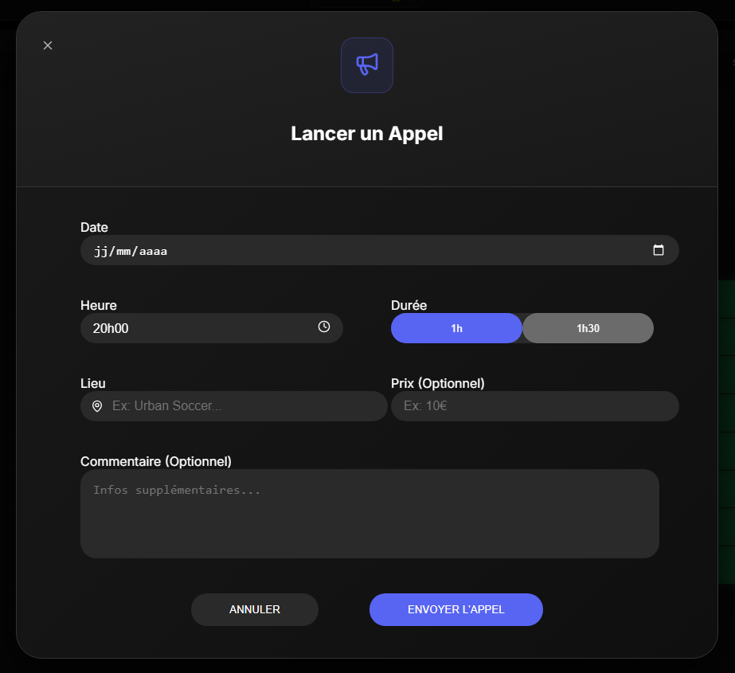
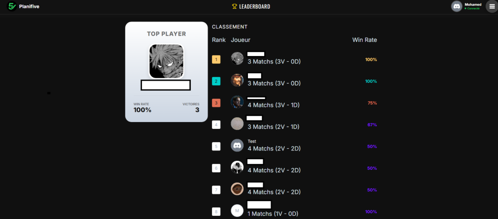
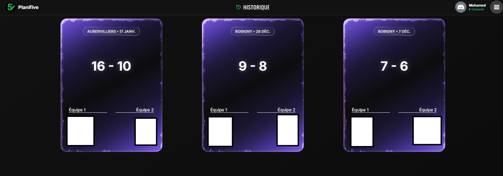
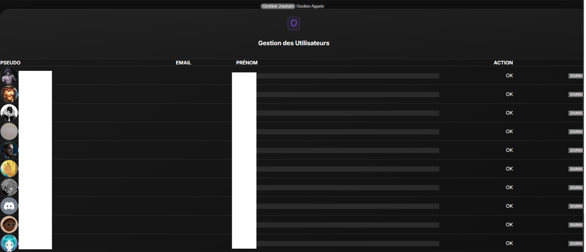
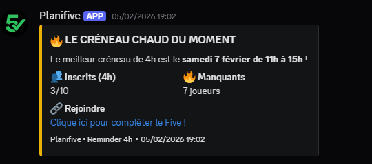
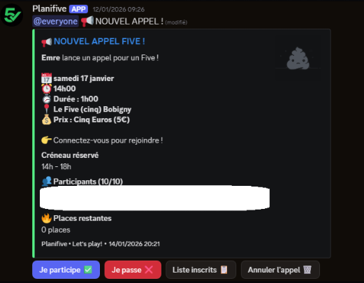

# Planifive

**Planifive** est une application web personnelle conçue pour simplifier l'organisation de matchs de foot en salle (Five). Elle centralise la gestion des créneaux, les votes de disponibilité et les statistiques des joueurs.

## Objectif du Projet

Ce projet a été développé pour répondre à un besoin personnel : automatiser l'organisation chronophage des matchs hebdomadaires via WhatsApp. Il sert aujourd'hui de démonstration technique de mes compétences en développement Fullstack et en intégration d'API tierces (Discord).

## Aperçu de l'application

Voici quelques captures d'écran illustrant les différentes fonctionnalités de Planifive :

### Grille de Planification & Votes



### Appel pour un match


### Classement (Gamification)


### Historique des Matchs


### Panel d'Administration



### Bot Discord



## Fonctionnalités Principales

* ** Planification & Votes** : Système interactif permettant aux joueurs de voter pour leurs créneaux de disponibilité.
* ** Écosystème Connecté (Discord)** :
    * Notifications automatiques des nouveaux sondages.
    * Rappels de vote via bot Discord personnalisé.
    * Synchronisation des avatars utilisateurs Discord <-> App.
* ** Gamification** : Leaderboard dynamique suivant les performances et l'assiduité des joueurs.
* ** Automatisation** : Tâches planifiées (CRON) pour la clôture des votes et l'envoi de rappels.
* ** Sécurité** : Authentification robuste via NextAuth.

## Stack Technique

Architecture moderne axée sur la performance et la type-safety :

| Domaine | Technologie | Usage |
| :--- | :--- | :--- |
| **Frontend** |   | App Router, Server Components, Design System |
| **Backend** |   | API Routes, Authentification, Cron Jobs |
| **Data** |   | Modélisation des données, gestion des migrations |
| **Langage** |  | Typage strict de bout en bout |
| **Bot** |  | Interactivité et notifications temps réel |

## Aperçu de l'Architecture

Le projet suit une architecture modulaire basée sur le **Next.js App Router** :

```text
/app
 ├── /api            # Endpoints API (Auth, Discord Hooks, Cron jobs)
 ├── /leaderboard    # Page de classement avec styles SCSS dédiés
 ├── /history        # Historique des matchs passés
 ├── /admin          # Interface d'administration
 └── /components     # Composants UI réutilisables (Modales de vote, Cartes)
/lib                 # Logique métier partagée (Client Discord, Prisma Singleton)
/prisma              # Schéma de base de données relationnelle
